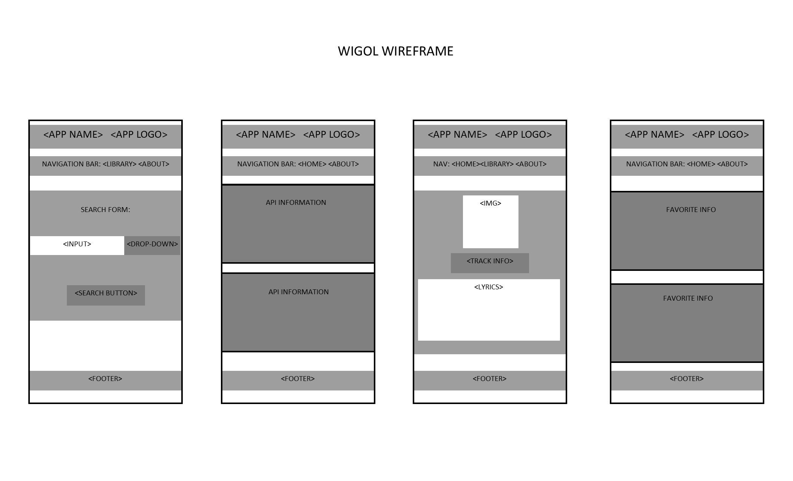
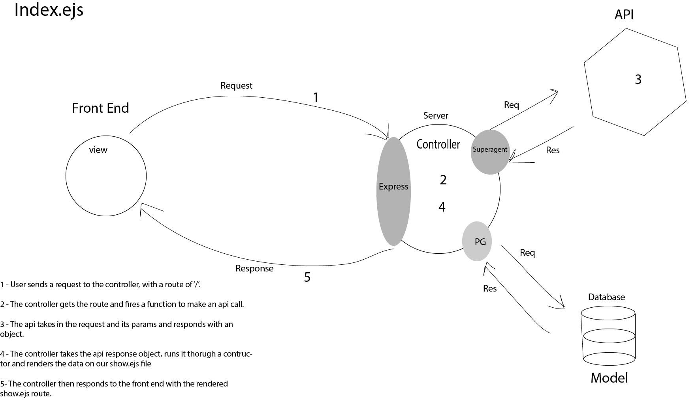
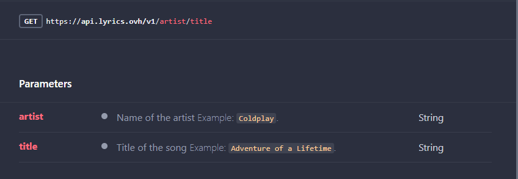

# Project: WIGOL

- Version 1.0.0 - 09/28/2020 - Initial application start and setup.
- Version 1.1.0 - 09/28/2020 - API connectivity, 'home' and 'search results' pages complete. Overall functionality is minimal.
- Version 1.2.0 - 09/29/20200 - Styling added, 'favorites' and 'song details' pages added. Overall functionality is improved and more dynamic.
- Version 2.0.0 - 09/29/2020 - Minimum viable product achieved. 

Have you ever thought of a song and just couldn't remember the lyrics? Or heard a song and thought, "What are they saying? Did I hear what I think I heard?" If so, this is an application for you! 

Introducing Wigol, an application that will retrieve data from a third-party API that will include lyrics, song name and artist name. You will have the option to save your favorite lyrics to your own library and easily make updates to your list of songs.

## Authors:

- Andre Olivier Martin
- Christopher Quiocho
- Lee Thomas
- Matt Ravenmoore

## Getting Started

1. Install Dependencies: Use "npm i":

- cors
- dotenv
- ejs
- express
- pg
- method-override
- superAgent

### Wireframes

### User Stories

**As a USER I would like an application that can search for song lyrics by ‘artist name’, ‘song name’ or by ‘entering a few lines of lyrics from a song’ and retrieve it’s complete lyrics for my personal use and entertainment.**

### Software Requirements

- Wigol will provide song title, artist name and lyrics all in one place.

- Wigol will not find products related to the song or album (merchandise, videos, etc.), results are strictly related to the music. 

**MVP**: Wigol will take in information from a search form and retrieve a song that will include lyrics, title and artist information. User will be able to save ‘favorite songs’ to a library that will have the option to delete song information.

**Stretch Goals: Generate a karaoke feature that will sync music and lyrics to scroll over a background of album art.**

### SCOPE:

1. Search Songs
1. Receive Lyrics and Song Information from API
1. Viewer can View Save Songs as a Collection
1. Results can be Saved / Updated / Deleted by User

### Domain Modeling

- Homepage: index.ejs => Search Form: by ‘artist name’ or by ‘song name’ or ‘by snippet of lyrics’.

- Results Page: pages/show.ejs => API information presented in a block with ‘add to library’ button. When user clicks on button it will take them to their library collection.

- Library Page: library/show.ejs => Song will be stored in database and displayed in a list. User will have the option to delete or view details of song info. Upon doing so, user will be redirected to same page.

- Detail Page: library/detail.ejs => Selected song will be displayed with song title, artist name and lyrics.

### API 

**https://lyrics.ovh/**

### Database Schemas

1. id SERIAL PRIMARY KEY
1. artist VARCHAR(255)
1. song VARCHAR(255)
1. lyrics TEXT

